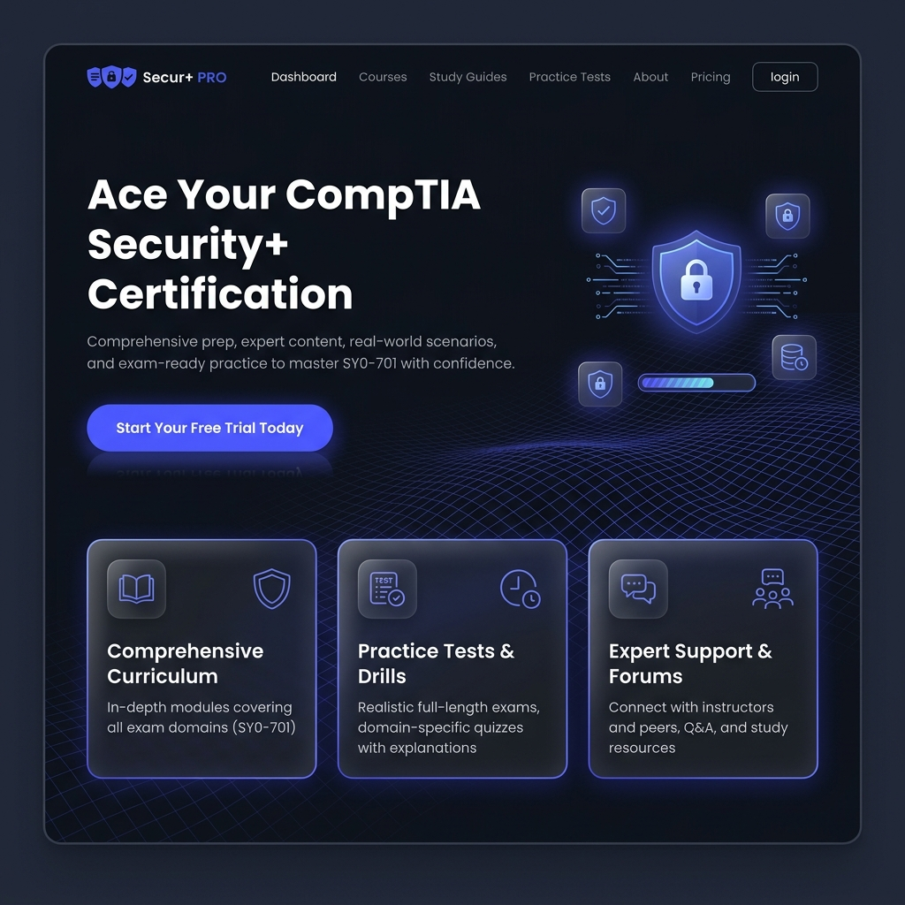
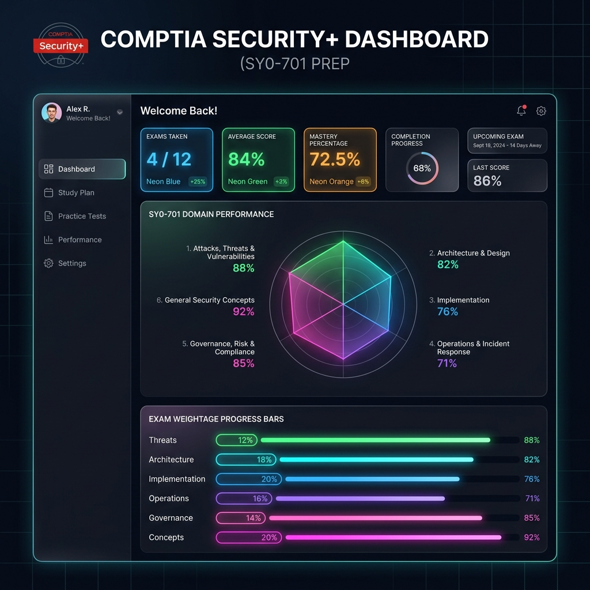

# 🛡️ CompTIA Security+ SY0-701 Exam Companion

A sleek, premium, highly interactive exam preparation platform for the CompTIA Security+ SY0-701 certification. Built with modern dark glassmorphism, responsive indicator controls, custom vector radar charts, and automated serverless GitHub Pages deployments.

## 📸 Screenshots

### Dark Mode Landing Portal


### Interactive Performance Diagnostics Dashboard


---

## ✨ Core Features

1. **Live Question Syncing**
   - Automatically fetches the latest verified question banks from raw GitHub repository endpoints at runtime.
   - Built-in format converters normalize exam questions into local TypeScript structures.

2. **Adaptive Target Distribution**
   - Analyzes your previous domain scores and dynamically weights question allocation to target weaknesses.
   - Matches official CompTIA SY0-701 exam blueprint distributions (General Security Concepts, Threats, Architecture, Operations, Program Management).

3. **Mastery Radar Grid**
   - High-fidelity SVG Spider Chart mapping your current competency levels.
   - Fully interactive hover bounds that highlight domain metrics, scale coordinates (20% - 100%), and outline the 75% passing benchmark.

4. **Tutoring & Concept Reinforcement**
   - Study mode triggers immediate explanations on incorrect selections.
   - Concept reinforcement loops fetch 2 alternative review questions under the same domain to solidify knowledge.

5. **Serverless Browser Architecture**
   - Runs 100% in the user's browser, allowing serverless static hosting on platforms like GitHub Pages.
   - Graceful timeout fallbacks fetch local databases if network latency is detected or APIs are offline.

6. **CI/CD Deployment**
   - Configured with GitHub Actions workflows to auto-compile and deploy static builds to the `gh-pages` branch on push.

---

## 🛠️ Tech Stack
- **Framework**: Next.js 16 (Static HTML Export)
- **Styling**: Tailwind CSS v4 (Custom dark themes, animations, glassmorphism variables)
- **State Management**: React Hooks (State, Memo, Callbacks) & LocalStorage database persistence
- **CI/CD**: GitHub Actions

---

## 🚀 Getting Started

### Local Development Setup

First, install dependencies:
```bash
npm install
```

Second, run the development server:
```bash
npm run dev
```

Open [http://localhost:3000/CompTIA-Sec-Test](http://localhost:3000/CompTIA-Sec-Test) with your browser to see the result.

### Building & Exporting Statics

To manually compile and build the static files to the `out/` folder:
```bash
npm run build
```

---

## 🌎 Deployment to GitHub Pages

The project is fully preconfigured for GitHub Pages static deployment:
1. Push your changes to the `main` branch.
2. The GitHub Action in `.github/workflows/deploy.yml` will automatically build and push the compiled assets to the `gh-pages` branch.
3. In your GitHub repository, go to **Settings > Pages**.
4. Set the **Build and deployment** source to `Deploy from a branch` and select `gh-pages` as the deployment branch.
5. Save, and your app will be live at `https://<your-username>.github.io/CompTIA-Sec-Test/`.
